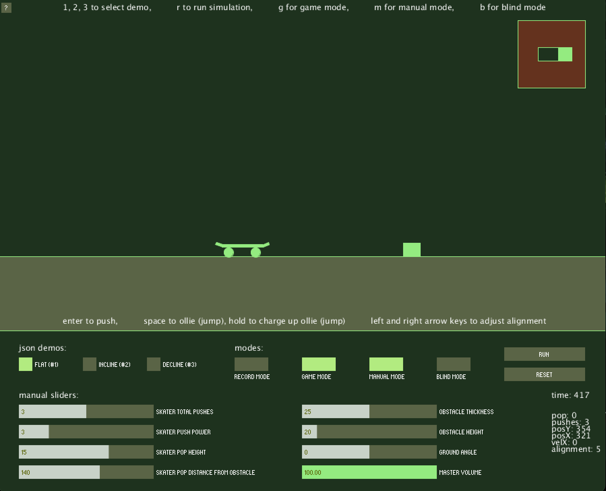

# Skateboarding Simulator - CS 4590
This paper describes the methodologies and findings for my CS 4590 final project, a skateboarding simulator that sonifies the action of popping an “ollie” on a skateboard over an object. And ollie is the basic “jumping” trick on a skateboard, the action of clearing an object while riding. The project includes a simulator, and user testing of the simulator to show that the auditory sonification provides improvements to physical performance.

## Documentation
[Research Document](readme.pdf)

[User Manual](readme.pdf)
